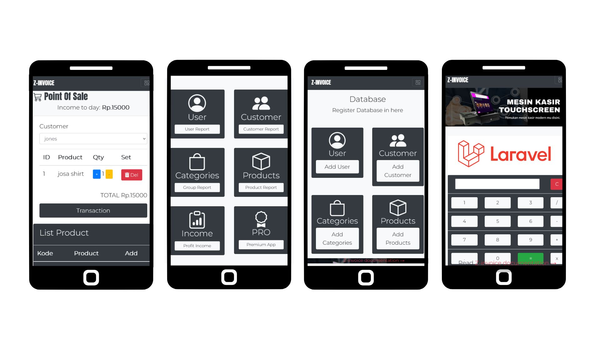
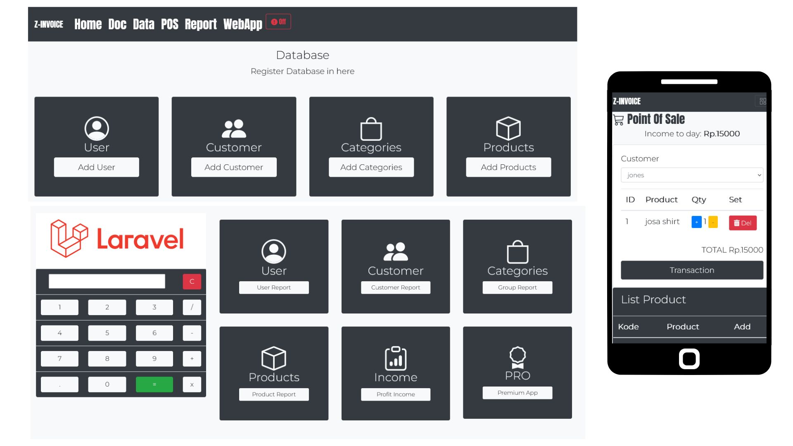
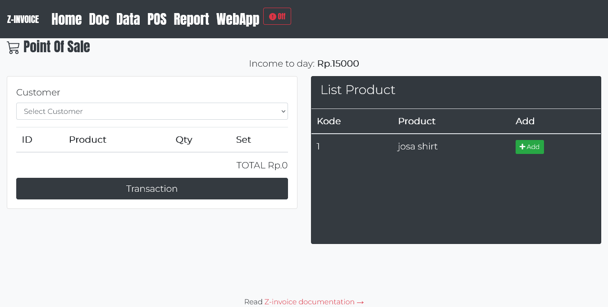

# LARAVEL POS WITH INVOICE Z-INVOICE APPS

Free Laravel pos web app - Z-Invoice

----------------------------------------

### 💖 Thanks for Sponsor 🤞 

    

----------------------------------------

### [🚀 Become a Sponsor](https://github.com/sponsors/mesinkasir) | [☕ Buy me Coffee](https://www.paypal.com/cgi-bin/webscr?cmd=_s-xclick&hosted_button_id=JVZVXBC4N9DAN)

----------------------------------------

### 🥇 Supporter 👨🏻‍🚀

    

----------------------------------------

Test Drive a demo [https://axcora.my.id/laravelpos/](https://axcora.my.id/laravelpos/)

Artisan php apps with point of sale management and invoice features. with [laravel](https://laravel.com)

For full installation and documentation visit here :
[https://www.hockeycomputindo.com/2020/09/aplikasi-toko-gratis-download.html](https://www.hockeycomputindo.com/2020/09/aplikasi-toko-gratis-download.html)

Complete with modern UI , Free download and Open source code.

Can be install on offline desktop or Clouds and upload it on your shared hosting for mobile apps integration with android smartphone or iphone.

Fast and stable with laravel php artisan serve.

----------------------------------------

### Update 

New update

Update new

Pos Cashier Transaction

------------------------------------

create mysql db or sqlite db

configure db .env

`composer install`

`composer update`

`php artisan migrate`

`php artisan db:seed`

`php artisan serve`

`open localhost:8000`

----------------------------------------------------------------------------------------------

## A freatures : 

Login with username and password , by default user name : admin@admin.com , password : 12345678

Home page menu.

User databased for create and register user account.

.png)

Customer databased for register customer.

.png)

Product group and categories.

.png)

Master Product databased.

.png)

Point of sale transaction.

.png)

Print invoice with letter format or you can print with receipt print, you can print with two print out method with you needed.

.png)

Report detailed for check transaction, and you can export report detailed.

----------------------------------------------------------------------------------------------

## How to install ?? [Cek video installation →](https://youtu.be/V6xW1EEwLcs)

For first you need download third party apps for using laravel point of sale with invoice system.

XAMPP for apache web server and mysql databased [Download here →](https://www.apachefriends.org/download.html)

Composer  [Download here →](https://getcomposer.org/download/)

Git Bash [Download here →](https://git-scm.com/downloads)

Download and install all third party apps.

Run xampp apache and mysql server , and create new databased rename with lapos

Download this apps, or clone/fork it 

----------------------------------------------------------------------------------------------

### Option 1: 

git clone https://github.com/mesinkasir/larapos.git

now on your project folder , right click and select git bash here.

and run command : 

composer install && php artisan migrate && php artisan db:seed && php artisan key:generate && php artisan serve

Open localhost:8000 on web browser and get started with laravel pos apps.

now you can view a laravel point of sale with invoice system web apps , just click on get started button and login to apps.

username : admin@admin.com / password : 12345678.

----------------------------------------------------------------------------------------------

### Option 2: 

Download and Extract Zip file download to your project folder, open localhost/phpmyadmin and select lapos on phpmyadmin , then click on import databased , upload zinvoice.sql if you wan to use apps include demo data, or select zinvoice - emptydb.sql if you need empty databased.

back to project folder again, and right click then select git bash here.

run command : 

composer install && php artisan key:generate && php artisan serve

Open localhost:8000 on web browser and get started with laravel pos apps.

now you can view a laravel point of sale with invoice system web apps , just click on get started button and login to apps.

username : admin@admin.com / password : 12345678.

### Enjoy it and hapy codding, be artisan with laravel php artisan.

Test Drive a demo [https://axcora.my.id/laravelpos/](https://axcora.my.id/laravelpos/)

For full installation and documentation visit here :
[https://www.hockeycomputindo.com/2020/09/aplikasi-toko-gratis-download.html](https://www.hockeycomputindo.com/2020/09/aplikasi-toko-gratis-download.html)

-----------------------------------------------------------

### Buy me a coffee ☕️ ❤️  ✌🏻 

[Paypall](https://www.paypal.com/cgi-bin/webscr?cmd=_s-xclick&hosted_button_id=JVZVXBC4N9DAN) [Gumroad](https://creativitaz.gumroad.com/l/coffee) [Github Sponsor](https://github.com/sponsors/mesinkasir)
